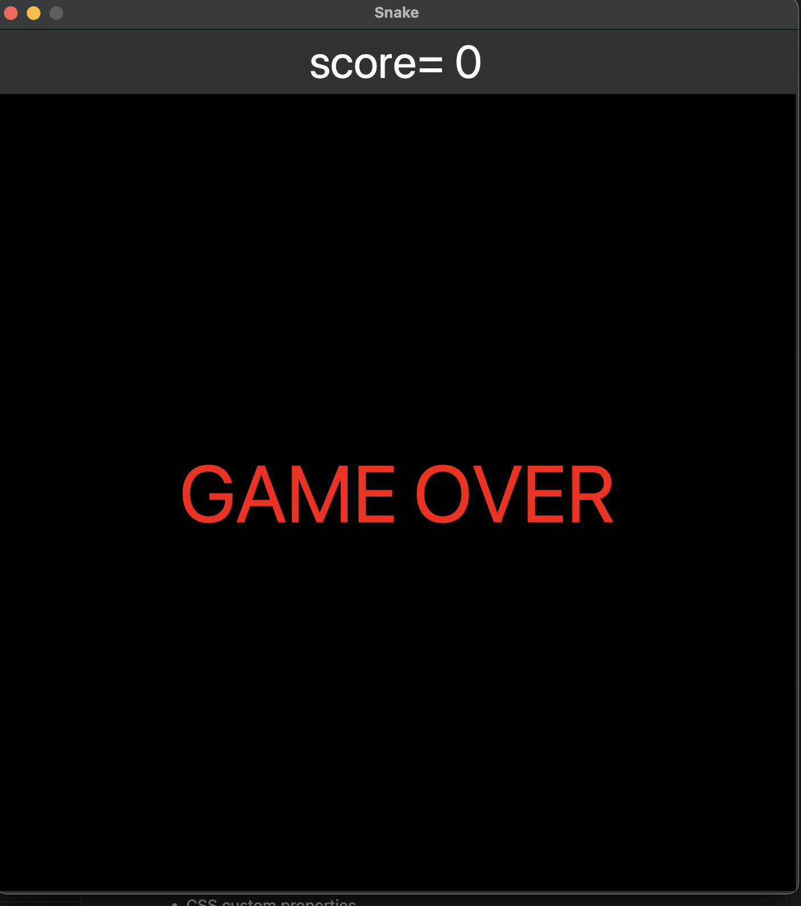

## Welcome! 👋
# snake Game
Beginning my Python learning journey, I considered creating a game to be an excellent starting point due to my interest in game development. Having previously developed games in C and C++, this approach seemed both familiar and engaging.

## Table of contents
-	[Overview](Ooverview)
	-  [Screenshoot](##Screenshoot)
- [Process](#Process)
	- [What i learned](##What-i-learned)
	- [Tools](##built)

# Overview

## Screenshot
  
# Process
## What i learned
 - Python classes
```python
	class Snake:

		def __init__(self):
			self.bodyParts = SNAKEPARTS;
			self.squares = [];
			self.coordinates = []

	class Food:
		def __init__(self):
			x = random.randint(0, int(WIDTH / SQUARE_SIZE) - 1) * SQUARE_SIZE
			y = random.randint(0, int(HEIGHT / SQUARE_SIZE)-1) * SQUARE_SIZE
```
 - Lists
```python
		self.coordinates = [x, y];
		x, y = Snake.coordinates[0];
		self.squares.append(square);
		Snake.coordinates.insert(0, [x, y]);


```
 - Working with [Tkinter](https://docs.python.org/3/library/tkinter.html) library
  ```python
	window = Tk();
	window.title(GAME_NAME);
	window.resizable(False, False);
	square = canva.create_rectangle(x, y, x + SQUARE_SIZE, y+SQUARE_SIZE fill=SNAKECOLOR);
```
## Tools
- [tkinter](https://docs.python.org/3/library/tkinter.html) :  GUI (Graphic User Interface) Python library


